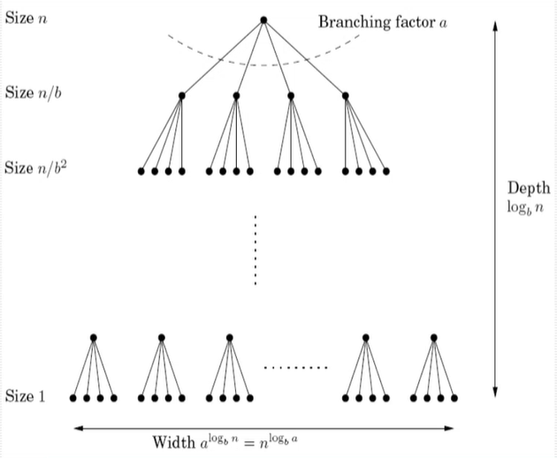
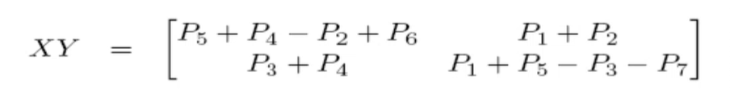
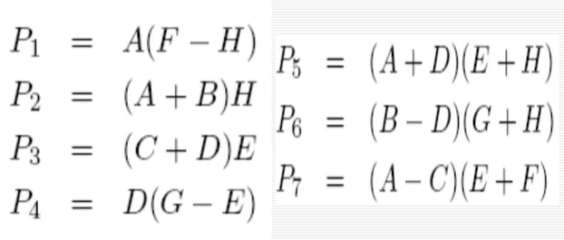

# Master Theorem

used to find the time complexity of an algorithm, when we know the recurrence relation: i.e. how it divides the problem into subproblem, and how does it use itself to solve the problem.

$T(n) = aT(\lceil\frac{n}{b}\rceil) + O(n^d)$

Here $O()$ is the time complexity for some other housekeeping/subsidiary/joining functions (i.e. functions that join the different solved subparts into the final answer)

$T(n) = \begin{cases} 
O(n^d) & d > \log_b a \\ O(n^d \log_bn) & d = \log_b a \\ O(n^{\log_b a}) & d <\log_b a \end{cases}$ 

for Karatsuba, we had $a = 3, b = 2, d = 1$

**Proof:** Dots denote problems/subproblems to solve

So the "work" / "effort" / calculation done at $k$th depth is: $a^k \times O((\frac{n}{b^k})^d) = O(n^d) \times (\frac{a}{b^d})^k$

We need the summation of this expression over all $k$  from $1$ to $n$. This is GP with common ratio $(\frac{a}{b^d})$ and starting term $n^d$

Three cases:

1. The ratio is $< 1$. Anyway the series is decreasing and the dominant term will be the first term only: $O(n^d)$
2. Ratio is $=1$. then there are $log_b n$ levels, each having $O(n^d)$ amount of work. This gives $O(n^d \log_bn)$
3. Ratio is $>1$. The series is increasing, and the dominant term will be its last term. Putting $k$ as $log_b n$ gives $O(n^d \cdot (\frac{a}{b^d})^{\log_bn})$ which on simplifies to $O(n^{\log_b a})$

# Divide and Conquer Algorithms

- Karatsuba integer multiplication (prev lec)
- Mergesort
- Matrix multiplication
- Median finding in linear time (next lec)

## Mergesort

1. Split the list into two equal/almost equal halves
2. Recursively sort both the halves
3. Merge the two sorted halves

$T(n) = 2T(n/2) + O(n)$ where $O(n)$ is the time taken for merging the two sorted halves. By Master Theorem, this gives $O(n\log{n})$.

### Why $\Omega(n\log n)$ is the lower bound for comparison based sort

We can go faster but then we need additional information about the dataset, for example it's range (bucket sort for example). Any comparison based sorting has to make atleast $n\log n$ comparisons.

- There are at max, $n!$ permutations, so the answer can be any 1 of these permutations
- if we have sorting algorithm which did k comparisons. By comparisons, we mean comparisons *within* a permutation. For example `{4, 2, 3, 1}` will give `{>, <, >}` because `4 > 2`, `2 < 3`, `3 > 1`. We used three comparisons here. there can be $2^k$ such `comparison_strings` and number of these `comparison_strings` should exceed $n!$ otherwise we can't guarantee the `comparison_string` like `{>,>,>,...,>}` or `{<,<,<,...,<}` showing up.
- $2^k$ is atleast $n!$
- $k$ is $\Omega(nlogn)$

## Matrix multiplication

- Naive: $O(n^3)$
- Strassen: $O(n^{\log_2 7})$
- Fastest known: $O(n^{2.37})$
- Absolute best: Unknown

Naive is $O(n^3)$ because it takes $O(n)$ to populate one element in the product matrix.

### Divide and conquer method

Suppose $X$ and $Y$ and two $n \times n$ matrices. We can divided each of them into 4  $\frac{n}{2} \times \frac{n}{2}$ matrices. Here, $A, B, C,D, E, F, G, H$ are matrices.

$X = \begin{bmatrix} A&B\\C&D \end{bmatrix}, \space Y = \begin{bmatrix} E&F\\G&H \end{bmatrix}$

$XY \begin{bmatrix} AE+ BG & AF + BH \\ CE+ DG & CF + DH \end{bmatrix}$

here, $T(n) = 8T(\frac{n}{2}) + O(n^2)$

Thus, $T(n) = O(n^3)$

### Strassen's Algorithm

Strassen figured out a hack which needed only 7 multiplications, instead of 8.

This gives $T(n) = 7T(\frac n 2) + O(n^2)$, so Strassen is $O(n^{\log_2 7}) = O(n^{2.81})$